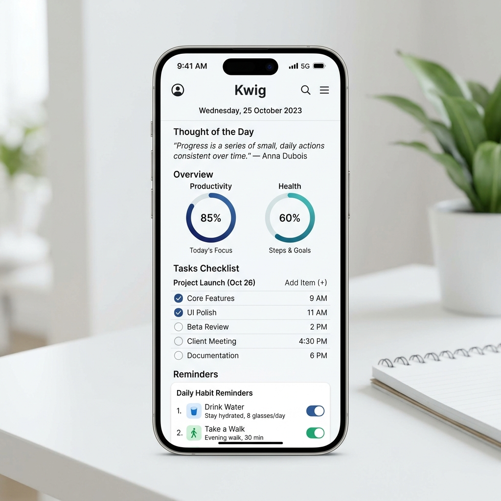
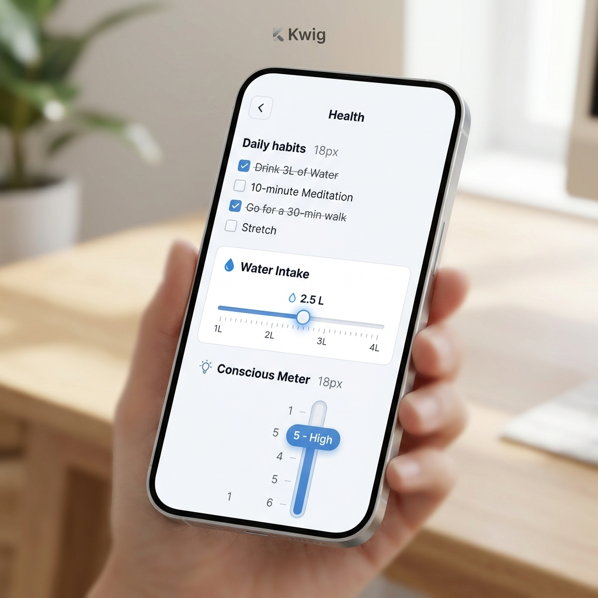

# Kwig — Minimalist Productivity, Health & Habit Tracker

Kwig is a sleek, lightweight, mobile-first productivity and personal growth application. Inspired by Notion's clean, minimalist aesthetics, Kwig helps you track daily habits, manage tasks, set timed healthy reminders, and review your weekly/monthly progress—all inside an optimized native mobile package under **1.8 MB** in size.

## Screenshots

<p align="center">
  
  
</p>

---

## Features

* 🧠 **Thought of the Day**: Starts your day with cycling minimalist motivational quotes. Tap to cycle to the next one.
* 📈 **Double Progress Rings**: Beautiful, dynamic circular rings tracking your Productivity and Health checklist completion percentages in real time.
* 📋 **Task Manager**: Organize daily tasks with customizable priorities (High, Medium, Low) and deadlines.
* 💧 **Smart Reminders (Notifier)**: Built-in notification triggers for "Drink Water" and "Go for a Walk" with configurable intervals (1 hr, 2 hr, 3 hr) and quick toggle switches.
* ⚖️ **Health Tracking Sliders**:
  * **Water Intake Scale**: Interactive slide scale ranging from 1L to 4L with 0.5L increments to easily track water metrics.
  * **Consciousness Meter**: A 1-to-6 index scale with dynamic ratings ("Low", "Decent", "High") to measure mindfulness.
* 📱 **Mobile-First Gestures (Long-press to Delete)**: Press and hold any task or habit row for 0.6 seconds to trigger a haptic-feedback custom deletion modal overlay.
* 🌗 **Light & Dark Mode**: Sleek manual theme toggle button placed at the top that saves preferences across reloads.
* 💾 **100% Offline Persistence**: Uses local storage fallbacks, ensuring your tracking logs and custom configurations stay secure and load instantly without requiring a server.

---

## Tech Stack & Architecture

* **Framework/Bundler**: [Vite](https://vitejs.dev/) + Vanilla JS
* **Styling**: Modern CSS variables, glassmorphism filters, safe-area layout padding (`env(safe-area-inset)`), and responsive media overrides.
* **Native Integration**: [Capacitor v6](https://capacitorjs.com/) (packages the web application into a fully native Android framework).
* **Native Plugins**: `@capacitor/local-notifications` (for background system notifications).

---

## Project Structure

```
x:/app/
├── android/                   # Native Gradle project for Android Studio
├── assets/                    # Image assets, icons, and screenshots
│   ├── Kwig.png               # Launcher icon
│   ├── screenshot_home.png    # Home screen screenshot
│   └── screenshot_health.png  # Health screen screenshot
├── dist/                      # Compiled production assets built by Vite
├── src/
│   ├── main.js                # Core JS logic, state, and rendering
│   └── style.css              # Typography, theme variables, and animations
├── capacitor.config.json      # Capacitor metadata configuration
├── index.html                 # Main HTML layout, fonts & style loads
├── package.json               # Node script and dependencies
└── vite.config.js             # Vite configuration
```

---

## Getting Started

### Prerequisites

Ensure you have [Node.js (v18+)](https://nodejs.org/) installed.

### 1. Install Dependencies
```powershell
npm install
```

### 2. Run Locally in Browser
```powershell
npm run dev
```
Open `http://localhost:3000` in your web browser. Enable Device Simulation in DevTools (e.g. mobile mode) to preview the optimized view.

### 3. Build & Sync Web Assets to Android
Whenever you modify the Javascript or CSS files, sync the changes to your Android project:
```powershell
npm run cap:sync
```

### 4. Compile to Android APK
If you set up the portable Android SDK toolchain in the project scratch folder, compile your optimized APK directly from terminal:
```powershell
powershell.exe -File scratch/build-apk.ps1
```
This builds your code, minifies unused libraries, and saves the output in the root folder as **`kwig.apk`** (~1.80 MB).
